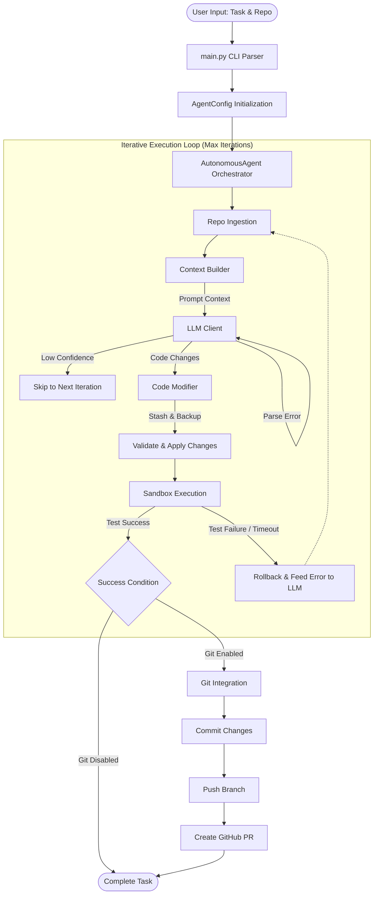

# 🏛️ Repopilot Architecture

Repopilot is an advanced, autonomous AI developer agent capable of independently modifying, testing, and committing code. This document outlines the high-level system architecture, core components, and the execution loop.

---

## 🔄 System Flow Architecture

The architecture relies on an iterative feedback loop, heavily orchestrated by the `AutonomousAgent`. Below is a visualization of the data flow and decision tree inside the system:

---

## 📦 Core Modules Breakdown

The codebase is highly modular, ensuring each component handles exactly one responsibility.

### 1. The Orchestrator

- **`main.py`**: The main CLI entry point. Responsible for parsing arguments (like runner, task, max iterations, Git configuration) and starting the `AutonomousAgent`.
- **`modules/agent_loop.py`**: Contains the core `AutonomousAgent` class. It manages the `while` loop connecting all other modules, handling logic such as early exits, timeout handling, and Git operations.

### 2. File & Context Management

- **`modules/repo_ingestion.py`**: Ingests the repository file tree safely, respecting `.gitignore` rules to avoid loading unnecessary files (e.g., node_modules, binaries).
- **`modules/context_builder.py`**: Controls exactly what text goes to the LLM. It limits the token window to prevent API overflow while ensuring the agent has sufficient context.

### 3. Intelligence & Execution

- **`modules/llm_client.py`**: The API wrapper for Anthropic. It constructs the system prompts and strictly parses structured JSON responses from the LLM, managing both initial requests and feedback retries.
- **`modules/code_modifier.py`**: Handles safe file operations. It verifies that target paths belong inside the repo, creates backups, applies literal or diff-based code edits, and provides rollback capabilities if testing fails.
- **`modules/sandbox.py`**: Executes test commands (`pytest`, `npm test`, etc.) using Python's isolated `subprocess` module. It captures `stdout`, `stderr`, and exit codes while enforcing hard timeouts.

### 4. Version Control Integration

- **`modules/git_integration.py`**: Wraps local `git` CLI operations (branching, staging, stashing, committing) and interfaces with the GitHub CLI (`gh`) to automatically create Pull Requests and branch tracking.

---

## 🔒 Security & Safety Mechanisms

- **Backup & Rollback:** The `CodeModificationEngine` caches modified files before applying changes. If an iteration completely fails, the original states are restored.
- **Sandbox Timeouts:** Prevents infinite loops or hanging tests by enforcing strict execution timeouts via `SubprocessSandbox`.
- **Pre-execution Confidence Check:** Changes with an LLM confidence score below a defined threshold (`min_confidence_to_apply`) are automatically rejected to avoid unstable commits.

---

## 🚀 Future Extensibility

- **Docker Sandbox Integration:** Transitioning from `SubprocessSandbox` to a fully isolated Docker container execution for safer, immutable test runs.
- **Multi-Model Fallback:** Extending `llm_client.py` to support OpenAI, Gemini, and local models.
- **AST-based Editing:** Implementing precise AST parsing instead of line-based diffs for modifying code structural integrity safely.
